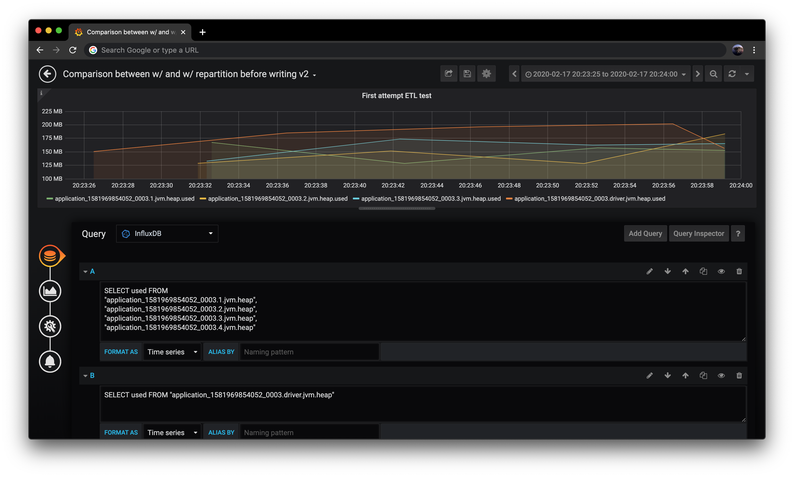
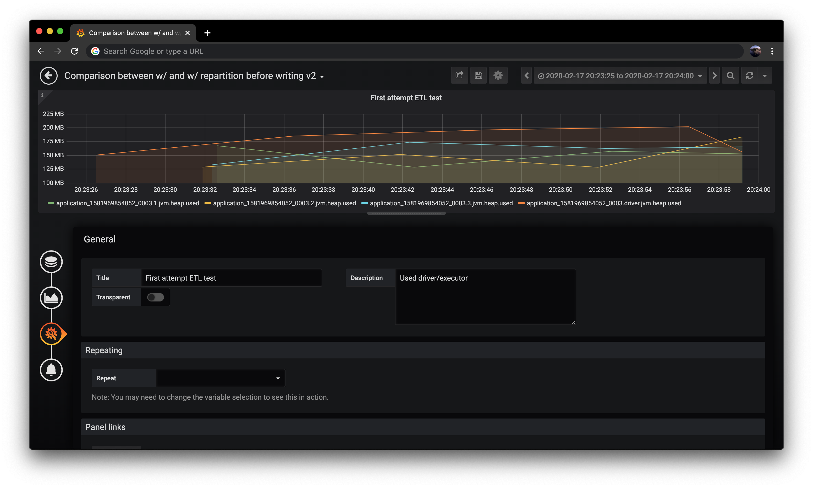
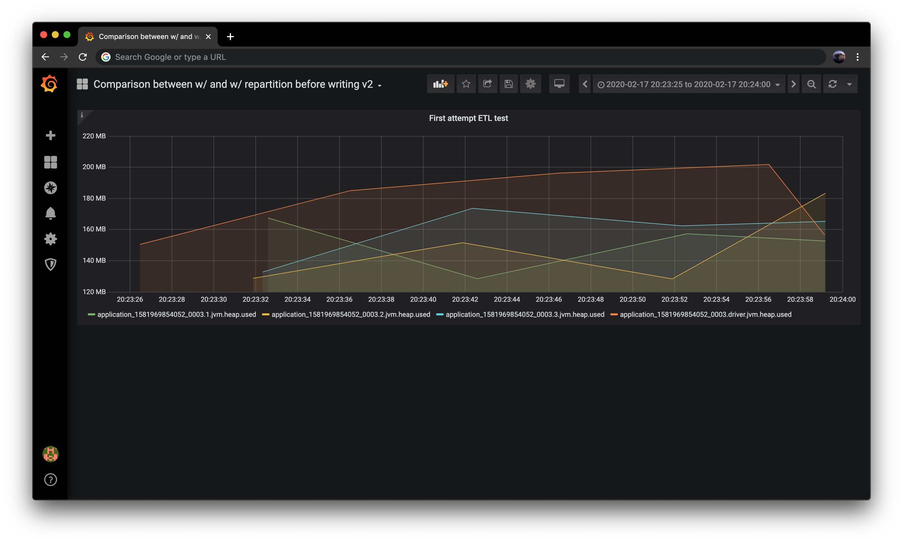
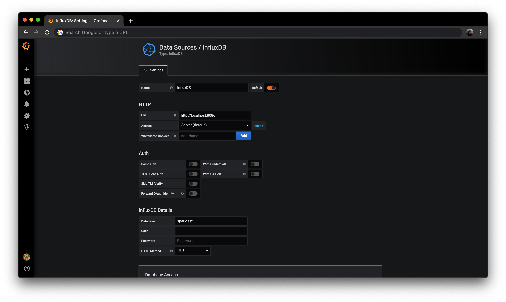

# Monitoring Spark on EMR with InfluxDB and Grafana

In this post, we configure and visualize Spark metrics (e.g. Executor JVM Heap usage) for Spark application running on Amazon EMR (hereafter, EMR) using InfluxDB and Grafana as follows. 

## What we will do
1. [Setting up InfluxDB on Amazon EC2](#1-setup-influxdb-on-amazon-ec2)
2. [Setting up Grafana on Amazon EC2](#2-setup-grafana-on-amazon-ec2)
3. [Configuring Spark Metrics](#3-configuring-spark-metrics)
4. [Monitoring Spark Application running on EMR](#4-monitoring-spark-application-running-on-emr)

<!--truncate-->

### Setting up the base resources
You need to set up the following resources to walk through this post contents.
* EMR (Release Label): emr-5.27.0
    * Spark 2.4.4
    * Hadoop 2.8.5
* Amazon Linux 2 instance (ami-0a887e401f7654935) was used in us-east-1 for InfluxDB and Grafana. 
* Used dataset for Spark application: [Amazon Customer Reviews Dataset](https://s3.amazonaws.com/amazon-reviews-pds/readme.html)

## 1. Setting up InfluxDB on Amazon EC2
We won't see how to setup of EC2 instance. After login the EC2 instance through SSH, install InfluxDB as follows (Ref: [Installing InfluxDB OSS](https://docs.influxdata.com/influxdb/v1.7/introduction/installation/#installing-influxdb-oss)):

```text
[ec2-user@ip-172-31-7-156 ~]$ cat <<EOF | sudo tee /etc/yum.repos.d/influxdb.repo
> [influxdb]
> name = InfluxDB Repository
> baseurl = https://repos.influxdata.com/centos/6/\$basearch/stable
> enabled = 1
> gpgcheck = 1
> gpgkey = https://repos.influxdata.com/influxdb.key
> EOF
[influxdb]
name = InfluxDB Repository
baseurl = https://repos.influxdata.com/centos/6/\$basearch/stable
enabled = 1
gpgcheck = 1
gpgkey = https://repos.influxdata.com/influxdb.key
```

The document says that you set `name = InfluxDB Repository - RHEL \$releasever` to `influxdb.repo`, however this configuration fails with 404 error in this case. (Ref: [repo Add support for Amazon Linux · Issue #5035 · influxdata/influxdb · GitHub](https://github.com/influxdata/influxdb/issues/5035))

After adding repository, you can install InfluxDB:

```text
[ec2-user@ip-172-31-7-156 yum.repos.d]$ sudo yum -y install influxdb
Loaded plugins: extras_suggestions, langpacks, priorities, update-motd
Resolving Dependencies
...
Installed:
  influxdb.x86_64 0:1.7.10-1

Complete!
```

Then, start InfluxDB and check if it is running:

```text
[ec2-user@ip-172-31-7-156 ~]$ sudo systemctl start influxdb
[ec2-user@ip-172-31-7-156 ~]$ ps aux | grep influx
influxdb  4605 89.0  0.2 1041040 35612 ?       Ssl  12:00   0:06 /usr/bin/influxd -config /etc/influxdb/influxdb.conf
```

## 2. Setting up Grafana on Amazon EC2

As same as the previous section about InfluxDB, you’ll add repository of Grafana, install and start Grafana-server (Ref: [Install on RPM-based Linux | Grafana Labs](https://grafana.com/docs/grafana/latest/installation/rpm/))

```text
[ec2-user@ip-172-31-7-156 ~]$ cat /etc/yum.repos.d/grafana.repo
[grafana]
name=grafana
baseurl=https://packages.grafana.com/oss/rpm
repo_gpgcheck=1
enabled=1
gpgcheck=1
gpgkey=https://packages.grafana.com/gpg.key
sslverify=1
sslcacert=/etc/pki/tls/certs/ca-bundle.crt

[ec2-user@ip-172-31-7-156 ~]$ sudo yum install grafana -y
...
Installed:
  grafana.x86_64 0:6.6.1-1

Dependency Installed:
  fontconfig.x86_64 0:2.10.95-11.amzn2.0.2    fontpackages-filesystem.noarch 0:1.44-8.amzn2    libXfont.x86_64 0:1.5.2-1.amzn2.0.2    libfontenc.x86_64 0:1.1.3-3.amzn2.0.2    stix-fonts.noarch 0:1.1.0-5.amzn2
  urw-fonts.noarch 0:2.4-16.amzn2             xorg-x11-font-utils.x86_64 1:7.5-20.amzn2.0.2

Complete!

[ec2-user@ip-172-31-7-156 ~]$ sudo systemctl start grafana-server
[ec2-user@ip-172-31-7-156 ~]$ ps aux | grep grafana
grafana   5251  2.1  0.2 1113740 41856 ?       Ssl  12:10   0:00 /usr/sbin/grafana-server --config=/etc/grafana/grafana.ini --pidfile=/var/run/grafana/grafana-server.pid --packaging=rpm cfg:default.paths.logs=/var/log/grafana cfg:default.paths.data=/var/lib/grafana cfg:default.paths.plugins=/var/lib/grafana/plugins cfg:default.paths.provisioning=/etc/grafana/provisioning
```

If possible, you should change the default configuration of username and password for Grafana. After this setup, you can access the Grafana-server through specified port number and then you can see following image:


## 3. Configuring Spark Metrics
In this section, you configure Spark metrics with login EMR via SSH. After launching EMR, login the Master Node and open `/etc/spark/conf/metrics.properties`. you can configure Spark metrics by adding [`Sink` class](https://github.com/apache/spark/blob/master/sql/core/src/main/scala/org/apache/spark/sql/execution/streaming/Sink.scala) to this property file. In this time, we'll configure pushing metrics to InfluxDB from Spark application, therefore add some InfluxDB configuration as follows:

```properties
#
# Licensed to the Apache Software Foundation (ASF) under one or more
# contributor license agreements.  See the NOTICE file distributed with
# this work for additional information regarding copyright ownership.
# The ASF licenses this file to You under the Apache License, Version 2.0
# (the "License"); you may not use this file except in compliance with
# the License.  You may obtain a copy of the License at
#
#    http://www.apache.org/licenses/LICENSE-2.0
#
# Unless required by applicable law or agreed to in writing, software
# distributed under the License is distributed on an "AS IS" BASIS,
# WITHOUT WARRANTIES OR CONDITIONS OF ANY KIND, either express or implied.
# See the License for the specific language governing permissions and
# limitations under the License.
#

#  syntax: [instance].sink|source.[name].[options]=[value]

...

# InfluxDB
# Enable InfluxDB
*.sink.influx.class=org.apache.spark.metrics.sink.InfluxDbSink
*.sink.influx.protocol=http
*.sink.influx.host=<HOSTNAME>
*.sink.influx.port=8086
*.sink.influx.database=<DB_NAME>

# Enable jvm source for instance master, worker, driver and executor
master.source.jvm.class=org.apache.spark.metrics.source.JvmSource
worker.source.jvm.class=org.apache.spark.metrics.source.JvmSource
driver.source.jvm.class=org.apache.spark.metrics.source.JvmSource
executor.source.jvm.class=org.apache.spark.metrics.source.JvmSource
```

After completion of Spark metrics, download jar files from following links and put them on home directory on your EMR (in this time). These jar files are used for getting Spark metrics based on DropWizard metrics format and pushing metrics to InfluxDB on EC2.
* [Maven Repository: com.palantir.spark.influx » spark-influx-sink » 0.4.0](https://mvnrepository.com/artifact/com.palantir.spark.influx/spark-influx-sink/0.4.0)
* [Maven Repository: com.izettle » dropwizard-metrics-influxdb » 1.2.3](https://mvnrepository.com/artifact/com.izettle/dropwizard-metrics-influxdb/1.2.3)

## 4. Monitoring Spark Application running on EMR
In this section, you write Spark code, and then run the code through `spark-submit`. After that, you visualize Spark metrics (in this time, we'll see JVM Heap metrics) using Grafana (query to InfluxDB).

### 4-1. Creating and Running the Spark app
In this section, we'll use following PySpark code as an exmple.

```py
# partition_by.py
import calendar
import time

from pyspark.context import SparkContext
from pyspark.sql import SparkSession
from pyspark.sql.functions import *

# Variables
APP_NAME = 'monit_spark'
INPUT = 's3://<BUCKET and PATH>'

now = datetime.datetime.utcnow()
TS = str(calendar.timegm(now.utctimetuple()))
# OUTPUT = "hdfs:///garbage-collection/" +  APP_NAME + "-" + TS + "/"
OUTPUT = "s3://<BUCKET and PATH>/" +  APP_NAME + "-" + TS + "/"

print("The data will be output to {}".format(OUTPUT))

# Main
spark = SparkSession.builder.appName(APP_NAME).getOrCreate()
df = spark.read.format("parquet").load(INPUT)
  
df_rep = df.repartition('review_date')
df_rep.write.format("json").partitionBy('review_date').save(OUTPUT)
```

Then, run the code with `spark-submit` in `cluster` mode. When executing `spark-submit`, don't forget to pass `spark.executor.extraClassPath` arguments and jars to the command.

```bash
$ nohup spark-submit \
--master yarn \
--deploy-mode cluster \
--jars 'metrics-influxdb.jar,spark-influx-sink.jar' 
--conf 'spark.driver.extraClassPath=spark-influx-sink.jar:metrics-influxdb.jar' \
--conf 'spark.executor.extraClassPath=spark-influx-sink.jar:metrics-influxdb.jar' \
--conf 'spark.sql.shuffle.partitions=xxx' \
partition_by.py >> app.log &
```

### 4-2. Querying for InfluxDB and Monitoring Spark App
After confirmation of running Spark application, check if Spark application pushing metrics at first. To check this, you need to access the EC2 instance via SSH and run a query for InfluxDB as follows.

```text
[ec2-user@ip-172-31-7-156 ~]$ influx -database <DB_NAME> -execute 'SHOW MEASUREMENTS'
name: measurements
name
----
CodeGenerator.compilationTime
CodeGenerator.generatedClassSize
CodeGenerator.generatedMethodSize
CodeGenerator.sourceCodeSize
HiveExternalCatalog.fileCacheHits
HiveExternalCatalog.filesDiscovered
HiveExternalCatalog.hiveClientCalls
HiveExternalCatalog.parallelListingJobCount
HiveExternalCatalog.partitionsFetched
application_1581969854052_0003.1.CodeGenerator.compilationTime
application_1581969854052_0003.1.CodeGenerator.generatedClassSize
application_1581969854052_0003.1.CodeGenerator.generatedMethodSize
...
```

You can confirm stored metrics in InfluxDB, then access to Grafana running on the EC2 intance. You'll add InfluxDB as a data source (see [How to setup Grafana for InfluxDB](how-to-setup-grafana-for-influxdb)) and then create a panel to visualize Spark metrics for the Dashboard. In that page, you can set a query to get metrics which are pushed to InfluxDB by the Spark application as follows.



Additionally, add the title and description of the panel.


After those configuration, save this panel from "save" button in the upper side of the page. Finally you can monitor metrics of Spark driver and executor JVM Heap usage!


## Appendix
### How to setup Grafana for InfluxDB
After login Grafana, you need "data source" firstly. You can add the data source through following steps:

1. Click "Configuration" (from left-side bar)
2. Click "Data Sources"
3. Go to "Add data source" and then select "InfluxDB"
4. Just specify "URL" and "Database" (as follows), and move on "Save & Test"



After adding data source, you can add a panel to the dashboard by clicking "+" > "Dashboard" > "Add Query" in the left-bar.

### How to get periodic metrics
If you want some periodic metrics, you can see with following query as an example:

```sql
SELECT mean("used") AS used_mean FROM 
"application_1581969854052_0010.1.jvm.heap", 
"application_1581969854052_0010.2.jvm.heap",
"application_1581969854052_0010.3.jvm.heap",
"application_1581969854052_0010.4.jvm.heap",
WHERE $timeFilter GROUP BY time(30s)
```

## Reference
1. AWS service icons are downloaded from [Architecture Icons](https://aws.amazon.com/architecture/icons/).
2. Apache Spark logo is downloaded from [Index of /images](http://spark.apache.org/images/).
3. InfluxDB logo is downloaded from [Downloads / InfluxData Branding Docs](https://influxdata.github.io/branding/logo/downloads/).
4. Grafana logo is downloaded from [grafana/grafana_icon.svg at master · grafana/grafana · GitHub](https://github.com/grafana/grafana/blob/master/public/img/grafana_icon.svg).
5. [GitHub - palantir/spark-influx-sink: A Spark metrics sink that pushes to InfluxDb](https://github.com/palantir/spark-influx-sink) 
